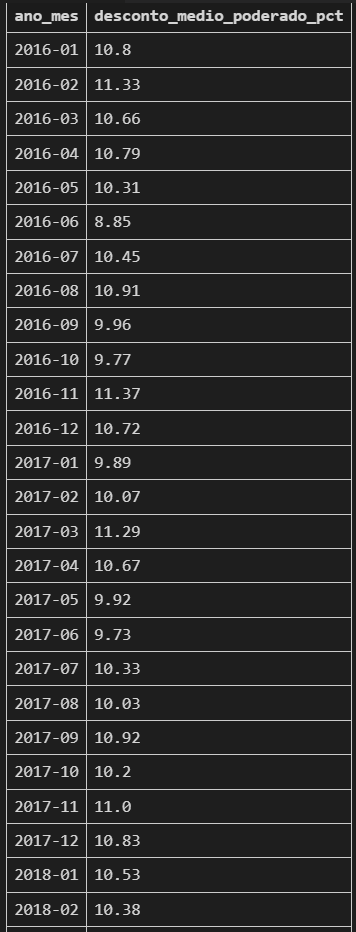
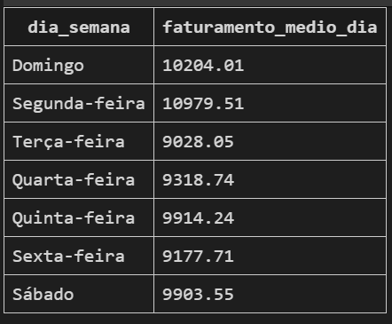

# Análise Comercial - Bike Store

Este repositório contém consultas SQL realizadas sobre uma base de dados fictícia **Bike Store**, com o objetivo de extrair **insights relevantes sobre vendas, clientes, produtos, categorias e deempenho por loja.**

Link para o dataset: [DATASET - BIKE STORE](https://www.kaggle.com/datasets/dillonmyrick/bike-store-sample-database)

---

As consultas estão organizadas em categorias, facilitando a navegação e a análise de diferentes aspectos do negócio.

---

## Estrutura das Categorias e Consultas

| Categoria | Título da Query | Nº | Caminho |
|-----------|-----------------|----|---------|
| **Vendas** | Faturamento Total | 01 | [`analises_vendas/01_faturamento_total.sql`](./Analises_Vendas/01_Faturamento_Total.sql) |
| | Produtos mais vendidos (em quantidade) | 02 | [`analises_vendas/02_top_produtos_vendidos_em_quantidade.sql`](./Analises_Vendas/02_Top_produtos_vendidos_em_quantidade.sql) |
| | Produtos que mais geraram receita | 03 | [`analises_vendas/03_top_produtos_mais_geraram_receita.sql`](./Analises_Vendas/03_Top_produtos_mais_geraram_receita.sql) |
| | Ticket médio por pedido | 04 | [`analises_vendas/04_ticket_medio_por_pedido.sql`](./Analises_Vendas/04_Ticket_medio_por_pedido.sql) |
| | Lojas com maior receita | 05 | [`analises_vendas/05_quais_lojas_mais_venderam_em_valor_total.sql`](./Analises_Vendas/05_Quais_lojas_mais_venderam_em_valor_total.sql) |
| | Evolução das vendas mês a mês | 06 | [`analises_vendas/06_evolucao_das_vendas_mes_a_mes.sql`](./Analises_Vendas/06_Evolucao_das_vendas_mes_a_mes.sql) |
| | % Médio de desconto aplicado | 07.00 | [`analises_vendas/07_00_percentual_medio_de_desconto_aplicado.sql`](./Analises_Vendas/07_00_percentual_medio_de_desconto_aplicado.sql) |
| | % Médio de desconto por categoria | 07.01 | [`analises_vendas/07_01_percentual_medio_de_desconto_aplicado_por_categoria.sql`](./Analises_Vendas/07_01_percentual_medio_de_desconto_aplicado_por_categoria.sql) |
| | % Médio de desconto por mês | 07.02 | [`analises_vendas/07_01_percentual_medio_de_desconto_aplicado_por_mes.sql`](./Analises_Vendas/07_02_percentual_medio_de_desconto_aplicado_por_mes.sql) |

| Categoria | Título da Query | Nº | Caminho |
|----------|------------------|----|---------|
| **Clientes** | Estados com mais clientes ativos | 08 | [`analises_clientes/08_estados_com_mais_clientes_ativos.sql`](./Analises_Clientes/08_Estados_com_mais_clientes_ativos.sql) |
| | Clientes que mais gastaram | 09 | [`analises_clientes/09_clientes_que_mais_gastaram.sql`](./Analises_Clientes/09_Clientes_que_mais_gastaram.sql) |
| | Média de pedidos por cliente | 10 | [`analises_clientes/10_qual_a_media_de_pedidos_por_cliente.sql`](./Analises_Clientes/10_Qual_a_media_de_pedidos_por_cliente.sql) |
| | Clientes unicos que compraram em cada loja | 11 | [`analises_clientes/11_quantos_clientes_unicos_compraram_em_cada_loja.sql`](./Analises_Clientes/11_Quantos_clientes_unicos_compraram_em_cada_loja.sql) |
| | Estados com mais clientes VIPs | 12 | [`analises_clientes/12_estados_com_mais_clientes_VIPS.sql`](./Analises_Clientes/12_Estados_com_mais_clientes_VIPS.sql) |

| Categoria | Título da Query | Nº | Caminho |
|----------|------------------|----|---------|
| **Produtos** | Produtos por Marca | 13 | [`analises_produtos/13_distribuicao_dos_produtos_por_marcas.sql`](./Analises_Produtos/13_Distribuicao_dos_produtos_por_marcas.sql) |
| | Categorias com maior variedade de produtos | 14 | [`analises_produtos/14_quais_categorias_possuem_maior_variedade_de_produtos.sql`](./Analises_Produtos/14_Quais_categorias_possuem_maior_variedade_de_produtos.sql) |
| | Faixa de preço por categoria | 15 | [`analises_produtos/15_faixa_de_preco_por_categoria.sql`](./Analises_Produtos/15_Faixa_de_preco_por_categoria.sql) |

| Categoria | Título da Query | Nº | Caminho |
|----------|------------------|----|---------|
| **Funcionários e Lojas** | Funcionários com mais vendas | 17 | [`analises_funcionarios_e_lojas/17_funcionarios_com_mais_vendas.sql`](./Analises_Funcionarios_e_Lojas/17_Funcionarios_com_mais_vendas.sql) |
| | Lojas com maior estoque | 18 | [`analises_funcionarios_e_lojas/18_loja_com_maior_estoque.sql`](./Analises_Funcionarios_e_Lojas/18_Loja_com_maior_estoque.sql) |

| Categoria | Título da Query | Nº | Caminho |
|----------|------------------|----|---------|
| **Tempo e Sazonalidade** | Meses com maior volume de venda | 21 | [`analises_tempo_e_sazonalidade/21_meses_com_maior_volume_de_venda.sql`](./Analises_Tempo_e_Sazonalidade/21_Meses_com_maior_volume_de_venda.sql) |
| | Faturamento por dia da semana | 22 | [`analises_tempo_e_sazonalidade/22_desempenho_medio_das_vendas_por_dia_da_semana.sql`](./Analises_Tempo_e_Sazonalidade/22_Desempenho_medio_das_vendas_por_dia_da_semana.sql) |

| Categoria | Título da Query | Nº | Caminho |
|----------|------------------|----|---------|
| **Indicadores Financeiros** | Meses com maior volume de venda | 24.00 | [`analises_indicadores_financeiros/24_00_valor_medio_de_desconto_por_categoria.sql`](./Analises_Indicadores_Financeiros/24_00_Valor_medio_de_desconto_por_categoria.sql) |
| | Faturamento por dia da semana | 24.01 | [`analises_indicadores_financeiros/24_01_valor_medio_de_desconto_por_categoria.sql`](./Analises_Indicadores_Financeiros/24_01_Valor_medio_de_desconto_por_categoria.sql) |
| | Faturamento por dia da semana | 25 | [`analises_indicadores_financeiros/25_quais_produtos_mais_vendidos_com_desconto_e_impacto_na_receita.sql`](./Analises_Indicadores_Financeiros/25_Quais_produtos_mais_vendidos_com_desconto_e_impacto_na_receita.sql) |

---

## Prints e Resultados

**Query 01 - Faturamento Total**

Resultado:

---

**Query 02 - TOP Produtos vendidos em Quantidade**

Resultado:

---

**Query 03 - TOP Produtos que mais geraram receita**

Resultado:

---

**Query 04 - Ticket médio por pedido**

Resultado:

---

**Query 05 - Lojas que mais faturaram**

Resultado:

---

**Query 06 - Evolução das Vendas - Mês a Mês**

Resultado:

---

**Query 07.00 - Percentual médio de desconto aplicado**

Resultado:

---

**Query 07.01 - Percentual médio de desconto por categoria**

Resultado:

---

**Query 07.02 - Percentual médio de desconto por mês**

Resultado:

---

**Query 08 - Estados com mais clientes ativos**

Resultado:

---

**Query 09 - Clientes que mais gastaram**

Resultado:

---

**Query 10 - Média de pedidos por cliente**

Resultado:

---

**Query 11 - Clientes únicos por loja**

Resultado:

---

**Query 12 - Estados com mais clientes VIPs**

Resultado:

---

**Query 13 - Produtos por marcas**

Resultado:

---

**Query 14 - Categorias com maior variedade de produtos**

Resultado:

---

**Query 15 - Faixa de preço por categoria**

Resultado:

---
**Query 17 - Funcionarios com mais vendas**

Resultado:

---
**Query 18 - Loja com maior estoque**

Resultado:

---
**Query 21 - Meses com maior volume de venda**

Resultado:

---
**Query 22 - Faturamento por dia da semana**

Resultado:

---
**Query 24.00 - Valor médio de desconto por categoria**

Resultado:

---
**Query 24.01 - Valor médio percentual de desconto por categoria**

Resultado:

---
**Query 25 - Produtos mais vendidos com desconto e impacto na receita**

Resultado:

---

## Conecte-se comigo
- [Gmail](mailto:0901dantaspedro@gmail.com)
- [Linkedin](https://www.linkedin.com/in/pedro-paulo-dantas-costa/)
- [Portfolio](https://pedropdc.github.io/portfolio/)
- [Medium](https://www.medium.com/@pedropdc/)

---