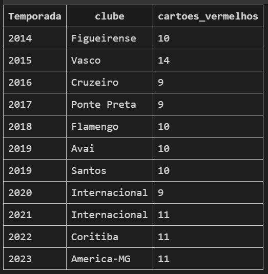
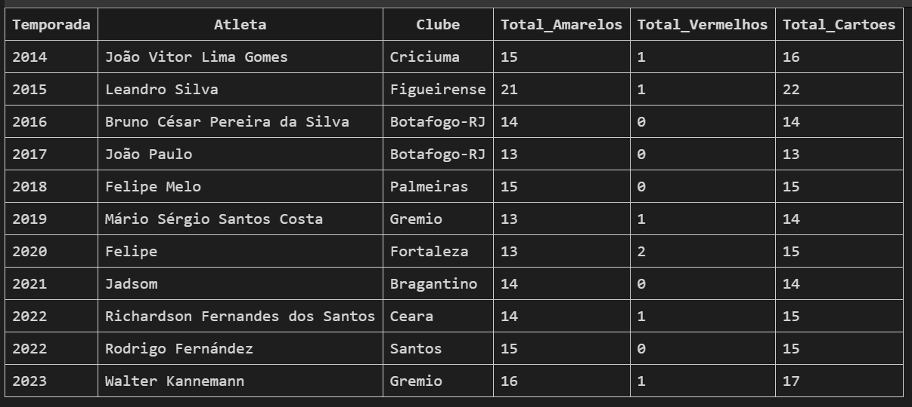
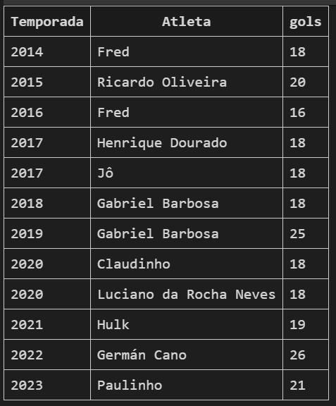
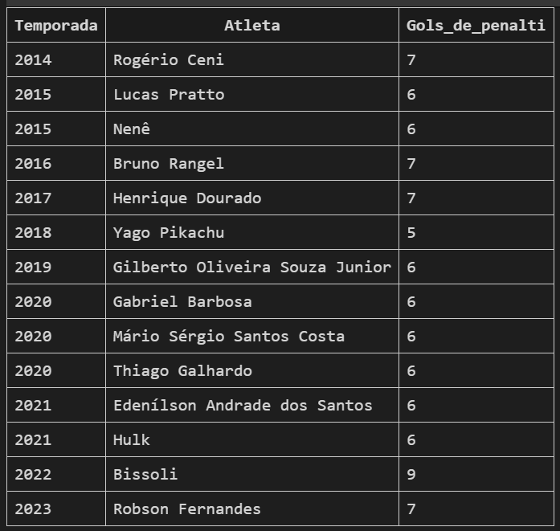

# Análise Exploratória do Brasileirão (2003-2023)

Este repositório contém consultas SQL realizadas sobre uma base de dados do Campeonato Brasileiro de Futebol, com o objetivo de extrair **conclusões relevantes sobre clubes, jogadores, partidas e tendências** ao longo dos anos.

As consultas estão organizadas em subpastas por categoria, com foco em facilitar a navegação e a análise.

---

## Estrutura das Categorias e Consultas

| Categoria | Título da Query | Nº | Caminho |
|-----------|-----------------|----|---------|
| **Clubes e Jogos** | Mais vitórias como mandante | 01 | [`clubes-e-jogos/01_mais_vitorias_mandante.sql`](./Clubes_e_Jogos/01_Mais_Vitorias_Como_Mandante.sql) |
| | Mais vitórias como visitante | 02 | [`clubes-e-jogos/02_mais_vitorias_visitante.sql`](./Clubes_e_Jogos/02_Mais_Vitorias_Como_Visitante.sql) |
| | Vitórias mandante e visitante | 03 | [`clubes-e-jogos/03_vitorias_mandante_visitante.sql`](./Clubes_e_Jogos/03_Vitorias_Mandante_e_Vitorias_Visitante.sql) |
| | Maior média de posse de bola | 04 | [`clubes-e-jogos/04_maior_media_posse.sql`](./Clubes_e_Jogos/04_Maior_Media_Posse_de_Bola.sql) |
| | Finalizações por ano | 05 | [`clubes-e-jogos/05_finalizacoes_por_ano.sql`](./Clubes_e_Jogos/05_Maior_Finalizacoes_por_Ano.sql) |
| | Clubes mais indisciplinados | 06.00 | [`clubes-e-jogos/06_00_clubes_indisciplinados.sql`](./Clubes_e_Jogos/06_00_Clubes_mais_Indisciplinados.sql) |
| | Mais cartões vermelhos | 06.01 | [`clubes-e-jogos/06_01_cartoes_vermelhos.sql`](./Clubes_e_Jogos/06_01_Mais_Cartoes_Vermelhos.sql) |
| | Mais cartões amarelos | 06.02 | [`clubes-e-jogos/06_02_cartoes_amarelos.sql`](./Clubes_e_Jogos/06_02_Mais_Cartoes_Amarelos.sql) |
| | Gols mandante, visitante e total | 07 | [`clubes-e-jogos/07_gols_mandante_visitante.sql`](./Clubes_e_Jogos/07_Mais_Gols_Marcados_Mandante_e_Visitante.sql) |

| Categoria | Título da Query | Nº | Caminho |
|----------|------------------|----|---------|
| **Análise de Jogadores** | Jogadores indisciplinados | 08 | [`analise-jogadores/08_jogadores_indisciplinados.sql`](./Analises_Jogadores/08_Jogadores_Indisciplinados.sql) |
| | Artilheiro por ano | 09 | [`analise-jogadores/09_artilheiro_por_ano.sql`](./Analises_Jogadores/09_Artilheiro_por_Ano.sql) |
| | Gols de pênalti por temporada | 10 | [`analise-jogadores/10_gols_penalti_por_temporada.sql`](./Analises_Jogadores/10_gols_penalti_por_temporada.sql) |
| | Gols nos acréscimos | 11 | [`analise-jogadores/11_gols_acrescimos.sql`](./Analises_Jogadores/11_Atleta_mais_gols_Acrescimos.sql) |

| Categoria | Título da Query | Nº | Caminho |
|----------|------------------|----|---------|
| **Análise de Partidas** | Partidas com mais gols | 12 | [`analise-partidas/12_partidas_com_mais_gols.sql`](./Analises_Partidas/12_Partidas_com_mais_gols_marcados.sql) |
| | Arenas com mais gols | 13 | [`analise-partidas/13_arenas_mais_gols.sql`](./Analises_Partidas/13_Arenas_com_mais_gols.sql) |
| | Rodadas com mais gols | 14 | [`analise-partidas/14_rodada_mais_gols.sql`](./Analises_Partidas/14_Rodada_com_mais_gols_por_temporada.sql) |
| | Maiores goleadas | 15 | [`analise-partidas/15_maiores_goleadas.sql`](./Analises_Partidas/15_maiores_goleadas.sql) |
| | Empates sem gols por temporada | 16 | [`analise-partidas/16_empates_sem_gols.sql`](./Analises_Partidas/16_Partidas_empatadas_sem_gols_por_temporada.sql) |

| Categoria | Título da Query | Nº | Caminho |
|----------|------------------|----|---------|
| **Padrões e Tendências** | Tendência de gols ao longo dos anos | 17 | [`padroes-tendencias/17_tendencia_gols.sql`](./Padroes_e_Tendencias/17_Aumento_ou_Reducao_Gols_por_Temporada.sql) |
| | Evolução da posse de bola | 18 | [`padroes-tendencias/18_evolucao_posse.sql`](./Padroes_e_Tendencias/18_Posse_de_bola_media_por_Temporada.sql) |
| | Precisão dos passes ao longo dos anos | 19 | [`padroes-tendencias/19_precisao_passes.sql`](./Padroes_e_Tendencias/19_Precisao_dos_passes_por_temporada.sql) |
| | Relação entre faltas e cartões | 20 | [`padroes-tendencias/20_faltas_cartoes.sql`](./Padroes_e_Tendencias/20_Numero_de_faltas_vs_cartoes.sql) |
| | Aproveitamento de pontos por temporada | 21 | [`padroes-tendencias/21_aproveitamento_pontos.sql`](./Padroes_e_Tendencias/21_Times_com_melhor_aproveitamento_de_pontos.sql) |

| Categoria | Título da Query | Nº | Caminho |
|----------|------------------|----|---------|
| **Consultas Avançadas** | Média de gols por partida por temporada | 22 | [`consultas-avancadas/22_media_gols_por_temporada.sql`](./Consultas_Avancadas/22_Media_gols_por_partida_Temporada.sql) |
| | Técnico com mais vitórias | 23 | [`consultas-avancadas/23_tecnico_mais_vitorias.sql`](./Consultas_Avancadas/23_Tecnico_com_mais_vitorias.sql) |
| | Minutos com mais gols | 24 | [`consultas-avancadas/24_minutos_com_mais_gols.sql`](./Consultas_Avancadas/24_Minutos_com_mais_gols.sql) |
| | Taxa de conversão de chutes em gols | 25 | [`consultas-avancadas/25_taxa_conversao_chutes.sql`](./Consultas_Avancadas/25_Taxa_de_conversao_de_chutes_em_gols.sql) |

---

## Prints e Resultados

**Query 01 - Mais vitórias como mandante**

Objetivo: Identificar os clubes com mais vitórias jogando como mandante em todo o período analisado.

Resultado:

---

**Query 02 - Mais vitórias como visitante**

Objetivo: Identificar os clubes com mais vitórias jogando como visitante em todo o período analisado.

Resultado:

---

**Query 03 - Vitórias como mandante e visitante**

Objetivo: Comparar o número total de vitórias dos clubes como mandante e como visitante

Resultado:

---

**Query 04 - Maior média de posse de bola por temporada**

Objetivo: Listar os clubes com a maior média de posse de bola por temporada.

Resultado:

---

**Query 05 - Mais finalizações por temporada**

Objetivo: Mostrar quais clubes mais finalizaram ao longo dos anos.

Resultado:

---

**Query 06.00 - Clubes mais indisciplinados**

Objetivo:  Identificar os clubes mais indisciplinados com base no total de cartões (vermelhos + amarelos).

Resultado:

---

**Query 06.01 - Mais cartões vermelhos**

Objetivo: Listar os clubes com o maior número de cartões vermelhos.

Resultado:

---

**Query 06.02 - Mais cartões amarelos**

Objetivo: Listar os clubes com o maior número de cartões amarelos.

Resultado:

---

**Query 07 - Mais gols marcados como mandante e visitante**

Objetivo: Identificar os clubes que mais marcaram gols como mandante, visitante e no total.

Resultado:

---

**Query 08 - Jogadores mais indisciplinados**

Objetivo: Identificar os jogadores mais indisciplinados com base na quantidade de cartões recebidos.

Resultado:

---

**Query 09 - Artilheiro por ano**

Objetivo: Listar o artilheiro de cada temporada com base no número de gols marcados.

Resultado:

---

**Query 10 - Mais gols de pênalti por ano**

Objetivo: Mostrar os jogadores que mais marcaram gols de pênalti por temporada.

Resultado:

---

**Query 11 - Atletas com mais gols nos acréscimos**

Objetivo: Identificar o jogador com mais gols marcados nos acréscimos (além dos 90 minutos).

Resultado:

---

**Query 12 - Partida com mais gols marcados**

Objetivo: Listar as partidas com o maior número total de gols marcados.

Resultado:

---

**Query 13 - Arenas com mais gols**

Objetivo: Mostrar as arenas onde ocorreram mais gols ao longo do período analisado.

Resultado:

---

**Query 14 - Rodada com mais gols por temporada**

Objetivo: Apontar a rodada de cada temporada com o maior número de gols marcados.

Resultado:

---

**Query 15 - Maiores goleadas**

Objetivo: Identificar os clubes com mais vitórias jogando como mandante em todo o período analisado.

Resultado: Identificar as maiores goleadas registradas no período analisado.

---
**Query 16 - Quantidade de partidas empatadas sem gols por temporada**

Objetivo: Mostrar a quantidade de partidas empatadas em 0x0 por temporada.

Resultado:

---
**Query 17 - Variação de gols por temporada**

Objetivo: Verificar se houve tendência de aumento ou queda no número médio de gols ao longo dos anos.

Resultado:

---
**Query 18 - Posse de bola média por temporada**

Objetivo: Analisar a evolução da posse de bola média dos clubes ao longo das temporadas.

Resultado:

---
**Query 19 - Precisão dos passes por temporada**

Objetivo: Avaliar se a precisão dos passes dos clubes tem melhorado ao longo dos anos.

Resultado:

---
**Query 20 - Relação: Faltas vs Cartões**

Objetivo: Analisar a relação entre número de faltas cometidas e número de cartões recebidos pelos clubes.

Resultado:

---
**Query 21 - Aproveitamento percentual de pontos em cada temporada**

Objetivo: Calcular o aproveitamento (%) de pontos dos clubes em cada temporada.

Resultado:

---
**Query 22 - Média de gols por partida em cada temporada**

Objetivo: Calcular a média de gols por partida em cada temporada.

Resultado:

---
**Query 23 - Técnicos com mais vitórias**

Objetivo: Identificar o técnico com mais vitórias no período analisado.

Resultado:

---
**Query 24 - Minutos com mais gols feitos**

Objetivo: Apontar os minutos do jogo em que ocorrem mais gols.

Resultado:

---
**Query 25 - Conversão de chutes em gols**

Objetivo: Calcular a taxa de conversão de chutes em gols por clube, considerando apenas partidas a partir de 01/02/2021.

Resultado:

---
## Conecte-se comigo
- [Gmail](mailto:0901dantaspedro@gmail.com)
- [Linkedin](https://www.linkedin.com/in/pedro-paulo-dantas-costa/)
- [Portfolio](https://pedropdc.github.io/portfolio/)
- [Medium](https://www.medium.com/@pedropdc/)

---
